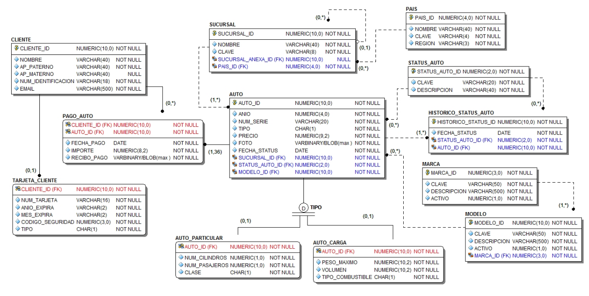

= MiAuto - Caso de estudio para Base de Datos Distribuidas
Creado por Rodrigo Francisco <rhodfra@gmail.com>
Version 1.0, 19.02.2021
:description: Caso de estudio, base de datos distribuidas
//:keywords: 
//:sectnums: 
// Configuracion de la tabla de contenidos
:toc: 
:toc-placement!:
:toclevels: 4                                          
//:toc-title: Contenido

// Ruta base de las imagenes
:imagesdir: ./README.assets/ 

// Resaltar sintaxis
:source-highlighter: pygments

// Iconos para entorno local
ifndef::env-github[:icons: font]

// Iconos para entorno github
ifdef::env-github[]
:caution-caption: :fire:
:important-caption: :exclamation:
:note-caption: :paperclip:
:tip-caption: :bulb:
:warning-caption: :warning:
endif::[]

Caso de estudio, base de datos distribuidas

toc::[]

== Reglas de negocio

[POR AGREGAR]

== Modelo relacional global

